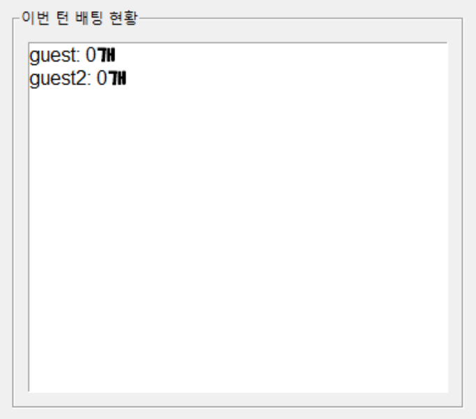

# 포커 게임 칩 계산기
## 제작 계기
> 애들이랑 기숙사에게 포커 게임을 하는데 칩 계산기가 필요하여 제작

## 사용 방법
> 먼저 실행한 후, 창을 최대화 하세요.

### [1] 플레이어 추가

> 이 창은 플레이어를 추가하는 창입니다.
> 이름란에 플레이어 이름, 그리고 초기 보유 칩을 작성하세요.

### [2] 게임 정보

> 게임 정보를 표기해 주는 창입니다.
> 현재 팟에 배팅된 칩의 개수를 표기해 주고, 전체 플레이어가 보유중인 칩의 합을 표기해 줍니다.

### [3] 플레이어 목록

> 현재 플레이 중인 플레이어의 목록을 보여줍니다.
> [1]에서 guest와 guest1을 각각 100개의 칩으로 추가해 보면,

> 위와 같이 표기가 됩니다.

### [4] 배팅 목록

> 현재 팟에 배팅된 금액이 표기됩니다.
> 어떤 플레이어가 얼마만큼의 칩을 배팅했는지 알 수 있습니다.

### [5] 칩 배팅

> 칩을 배팅할 수 있는 창입니다.

> [3] 에서 배팅하는 플레이어를 선택하고
> 배팅할 금액을 입력하면 팟에 칩이 추가됩니다.

### [6] FOLD(다이)

> [5]의 창에서 FOLD를 할 수 있는데

> [3]에서 플레이어를 선택한 후, 빨간색 "다이" 버튼을 누르면 됩니다.

> FOLD를 하더라도, 이미 배팅한 칩은 회수되지 않습니다.

### [7] 승자 선택

> 이 창에서 승자를 선택할 수 있습니다.

> 위 창에서 승자를 선택하고, "팟 분배" 버튼을 클릭하면 팟이 승자에게 제공됩니다.

# PLAY ENJOY!